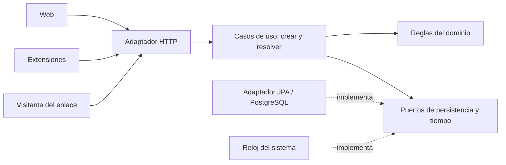
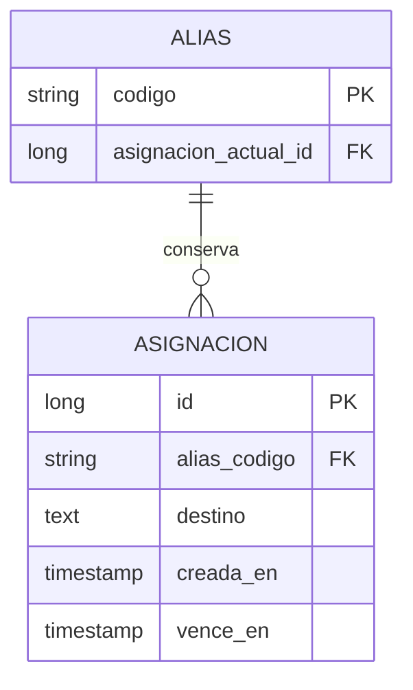

# Arquitectura y validación de la etapa 1

Estado: diseño confirmado por el usuario al cierre de la entrevista, sobre los [acuerdos de requisitos](requisitos-etapa-1.md). La revisión de requisitos y arquitectura queda cerrada. La especificación técnica detallada, la implementación y las pruebas del sistema permanecen pendientes.

## Estructura y dependencias

Un monolito Spring Boot contiene las reglas de negocio, los casos de uso y los adaptadores de entrada HTTP y salida JPA/PostgreSQL. La web y las extensiones comparten la API de creación. La redirección es un adaptador HTTP del mismo caso de uso de resolución.



El dominio no importa Spring, JPA ni tipos HTTP. Los casos de uso coordinan reglas, tiempo y persistencia; los adaptadores traducen solicitudes, respuestas y registros. El alcance de las transacciones debe abarcar reserva de alias, creación de asignación y actualización de su referencia actual, aunque ese límite se implemente mediante mecanismos de Spring.

La API expone DTO propios. La política de selección de alias se separa de las operaciones que permiten reservarlo de forma atómica. No se agrega una interfaz por cada clase: se utilizan puertos para dependencias externas y variabilidad acordada.

## Modelo lógico de datos



El código identifica al alias; el identificador interno identifica a cada asignación. Cada alias mantiene una referencia a su asignación actual o última. La referencia puede seguir apuntando a una asignación vencida hasta la siguiente reutilización: vigencia y existencia son conceptos distintos. El diagrama expresa el modelo lógico, no un esquema JPA definitivo.

Una asignación vencida permanece en el historial y no resuelve el enlace público. Reutilizar el alias agrega otra asignación y actualiza la referencia actual sin modificar los datos históricos. La referencia debe pertenecer al mismo alias, una condición que la persistencia debe garantizar. El tipo del código permite longitud variable; no debe quedar restringido a cinco caracteres.

El vencimiento se calcula una vez para cada creación y se persiste. Cambiar la duración de las nuevas asignaciones no modifica las existentes. Las marcas de tiempo representan instantes comparables; el reloj de las pruebas se puede controlar sin esperar una hora real.

## Selección de alias

Alfabeto concreto confirmado, consistente con los símbolos acordados:

```text
123456789ABCDEFGHJKLMNPQRSTUVWXYZabcdefghijkmnopqrstuvwxyz
```

1. Buscar alias cuya asignación ya venció, ordenados por longitud ascendente.
2. Si hay candidatos, reservar uno de la longitud mínima. El desempate puede ser determinista por código.
3. Si no hay candidatos, generar un código nunca usado ni reservado de la longitud mínima disponible: un carácter, luego dos, etc.
4. Crear una nueva asignación y actualizar la referencia actual en la misma transacción.

La enumeración no necesita precargar todo el espacio de códigos. La persistencia debe conservar el avance o permitir reconstruirlo sin perder qué códigos se usaron, incluso después de reiniciar. El historial permanece aunque cambie la política de selección en una etapa posterior.

Con 58 símbolos existen 58 códigos de un carácter y 3.364 de dos, antes de descontar reservas. El objetivo de 1.000 asignaciones vigentes cabe en ese espacio; la cantidad de asignaciones históricas puede superar ampliamente la cantidad de alias.

Las búsquedas y la reserva deben impedir tanto duplicaciones como decisiones simultáneas que salteen códigos más cortos disponibles. Para la carga de referencia puede utilizarse una coordinación transaccional única para la asignación de códigos; el mecanismo concreto queda para la especificación técnica. Si aumenta la carga, ese mecanismo se puede modificar dentro del adaptador sin cambiar el contrato ni la identidad de las asignaciones.

## Contratos y configuración por completar

La creación devuelve la dirección pública y el instante de vencimiento. Cada solicitud aceptada crea una asignación independiente; los clientes no asumen que repetirla recuperará el resultado anterior. Web y extensiones generan el QR sobre esa dirección y permiten descargarlo como PNG.

La resolución verifica la asignación actual y su vencimiento en el instante de resolución del servidor. Devuelve una redirección HTTP 302 cuando está vigente o una página con HTTP 404 cuando no lo está. Usar `Cache-Control: no-store` para impedir que caches conformes reutilicen una redirección vencida. Referencias: [RFC 9110, 302](https://www.rfc-editor.org/rfc/rfc9110.html#name-302-found) y [RFC 9111, no-store](https://www.rfc-editor.org/rfc/rfc9111.html#name-no-store-2).

La URL pública es configuración del despliegue, no un valor derivado de cada solicitud ni un `localhost` incrustado en el resultado. Los orígenes configurados del servicio incluyen sus direcciones equivalentes para rechazar enlaces propios. Las extensiones deben poder configurar la dirección de la API para la instalación manual.

La entrada de destino admite hasta 8.192 caracteres. Se rechazan formato inválido y espacios sin codificar; no se trunca ni corrige silenciosamente el destino. OpenAPI ya fija estos límites, sus errores y los casos de caracteres internacionales (Unicode en crudo rechazado; dominio punycode y percent-encoding UTF-8 aceptados; escapes `%` inválidos rechazados), con ejemplos por código de error. Esta decisión no autoriza rechazar credenciales incrustadas ni consultar la disponibilidad del destino. Las versiones y bibliotecas se fijarán junto al proyecto, manteniendo Java 17, Maven y una versión estable compatible de Spring Boot. Las migraciones de esquema se versionarán desde el inicio para conservar datos entre etapas.

## Pruebas previstas

| Escenario | Resultado verificable |
| --- | --- |
| Destino repetido | Dos solicitudes aceptadas producen asignaciones independientes. |
| Límite temporal | Justo antes del vencimiento resuelve; al alcanzarlo ya no resuelve. |
| Reinicio | Conserva destino, historial y vencimiento original; el tiempo apagado cuenta. |
| Reciclaje | Prefiere vencidos, elige los más cortos y conserva la asignación anterior. |
| Expansión | Agota códigos de una longitud antes de generar uno de la siguiente. |
| Concurrencia | Ninguna asignación vigente ni histórica se sobrescribe; cada creación exitosa recibe un alias exclusivo durante su vigencia. |
| Resolución concurrente | No combina el destino de una asignación con el vencimiento de otra. |
| Reintento | Puede crear otra asignación; no promete idempotencia. |
| Destinos | Acepta formato válido sin disponibilidad, conserva parámetros y fragmentos y permite credenciales; rechaza orígenes propios. |
| Límite de entrada | Acepta un destino de formato válido de 8.192 caracteres y rechaza uno de 8.193; no persiste versiones truncadas. |
| Espacios | Rechaza espacios sin codificar con error visible y conserva la codificación válida del destino recibido. |
| Sin asignación vigente | HTTP 404 con el mensaje acordado. |
| Resultado | URL pública, vencimiento, aviso y QR PNG en web y ambos complementos. |
| Demo LAN | Celular escanea el QR y alcanza el destino mediante el servicio. |
| Capacidad | Con 1.000 asignaciones vigentes y 10 clientes simultáneos conserva las reglas de unicidad, resolución y persistencia; al menos el 95 % de las solicitudes responden en un segundo o menos. |

Las reglas se prueban sin servidor HTTP ni base cuando sea posible; la reserva concurrente, transacciones y reinicio se verifican en integración sobre PostgreSQL. Los contratos HTTP se prueban además de las reglas. La capacidad es un objetivo de verificación, no un límite comercial.

### Procedimiento para medir respuesta

Iniciar el servicio y PostgreSQL, preparar 1.000 asignaciones vigentes y comprobar conectividad LAN. Ejecutar una fase de calentamiento antes de medir. Mantener 10 clientes concurrentes y registrar al menos 1.000 solicitudes de cada operación, evaluando creación y resolución por separado. Registrar duración, estado HTTP, cantidad de errores y cumplimiento de invariantes; un error inesperado no cuenta como éxito por responder rápido.

La medición termina al recibir la respuesta del acortador. Para resolución, desactivar el seguimiento automático de redirecciones: el tiempo de carga del destino externo queda excluido. En cada operación, al menos el 95 % de las solicitudes deben completar su respuesta en un segundo o menos. Conservar el entorno, el tamaño del historial, el volumen de datos y los resultados para repetir la comparación en etapas posteriores. La ejecución de esta prueba permanece pendiente.

## Cambios representativos

| Cambio | Qué debería cambiar | Evidencia y límite |
| --- | --- | --- |
| Otra duración para nuevas asignaciones | Regla de duración utilizada al crear; persistir el nuevo vencimiento. | Experimento acotado: asignaciones anteriores conservan su vencimiento, las nuevas reciben el nuevo; restituir 60 minutos para la entrega. |
| Alias personalizados | Entrada opcional en el contrato y política de reserva. | Analizar validación, colisiones y reutilización; mantener creación automática y clientes existentes compatibles. No se implementa en etapa 1. |
| Consola de gestión | Nuevos casos de uso de consulta y un cliente de gestión. | Consultar identidad e historial sin alterar cómo resuelve el enlace público. Si permite editar o borrar, requerirá nuevas reglas y posiblemente autorización. |
| Estadísticas | Registro de visitas y consultas asociadas a la identidad de la asignación. | Las estadísticas deben distinguir usos sucesivos del mismo alias; el historial de asignaciones no recupera visitas pasadas. |
| Mayor concurrencia | Coordinación y consultas de reserva en persistencia. | Cambiar el adaptador manteniendo las invariantes y las pruebas. No implica que el mecanismo inicial escale sin límites. |

Este diseño localiza cambios plausibles y conserva datos útiles; no demuestra todavía su costo real. La evidencia de adaptación provendrá del experimento y de las pruebas, no únicamente del diagrama.
